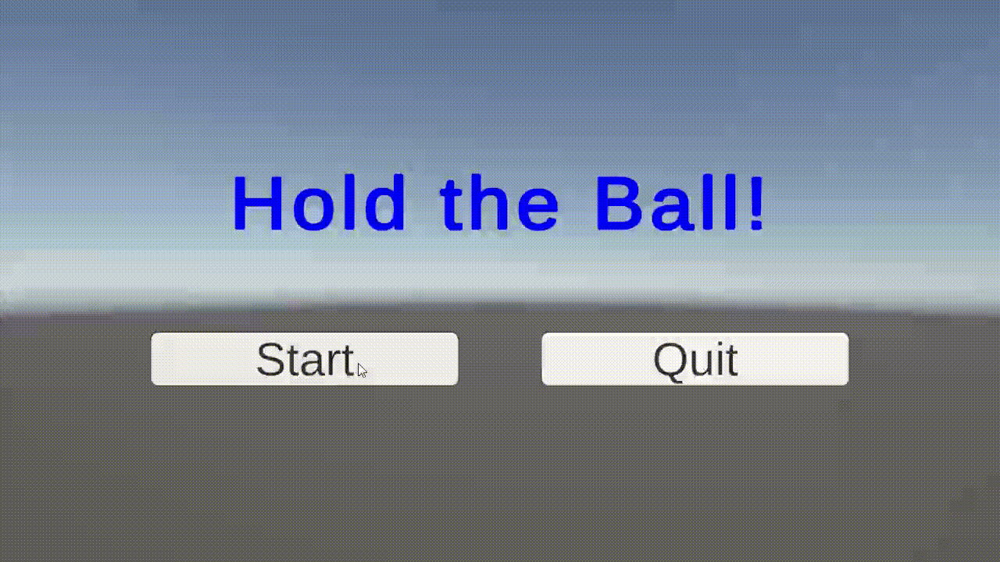

# ボールゲームプロジェクト

このプロジェクトは、Unityで開発されたシンプルなボールゲームです。プレイヤーはボールを操作し、特定の条件を満たすことでゲームクリアを目指します。

## 概要

このゲームは、ボールの操作、衝突判定、ゲームの状態管理、スコア管理、UI表示など、ゲーム開発における基本的な要素を含んでいます。

## 機能

* **ボールの挙動:** ボールは物理演算に基づいて動作し、プレイヤーの操作によって移動します。
* **衝突判定:** ボールと床の衝突を検出し、ゲームの進行に影響を与えます。
* **ゲームの状態管理:** ゲームの開始、終了、クリア、オーバーなどの状態を管理します。
* **スコア管理:** プレイヤーのスコアを記録し、ランキングを表示します。
* **UI表示:** ゲームの進行状況、スコア、ランキングなどを表示します。
* **ステージ傾斜:** ステージを傾けることで、ボールの動きを制御できます。

## 構造

プロジェクトは以下の要素で構成されています。

* **ボール:** `Ball`クラスがボールの挙動を制御します。
* **衝突判定:** `BallCollisionHandler`クラスがボールと床の衝突を処理します。
* **ボール生成:** `IBallFactory`と`BallFactory`がボールの生成と破棄を管理します。
* **ゲームデータ:** `BallData`クラスがボールの接触時間などのデータを保持します。
* **ゲーム管理:** `GameManager`クラスがゲーム全体の進行を管理します。
* **ゲームモデル:** `IGameModel`と`GameModel`がゲームの状態とデータを保持します。
* **ゲームルール:** `IGameRule`と`GameRule`がゲームのクリア条件とオーバー条件を定義します。
* **スコア管理:** `IScoreDataStorage`と`ScoreDataStorage`がスコアの保存と読み込みを管理します。
* **ステージ管理:** `IStageManager`と`StageManager`がステージの傾斜を制御します。
* **ゲームプレゼンター:** `GamePresenter`クラスがゲームのロジックとUIを接続します。
* **ゲーム入力:** `IGameInput`と`GameInput`がプレイヤーの入力を処理します。
* **ゲームビュー:** `IGameView`と`GameView`がゲーム画面の表示を管理します。
* **ステージ傾斜制御:** `IStageTiltController`と`StageTiltController`がステージの傾斜を制御します。

## 開発環境

* Unity 6 [6000.0.36f1]
* Windows 10 (64bit) - Intel(R) Core(TM) i7-6700K, 64GB RAM, NVIDIA GeForce GTX 1080

## 動作環境

...

### 動作確認済み環境

* **モバイル:**
  * Android 13 - Google Pixel 4a

## ライセンス

このゲームは、MIT License の下で提供されています。

## クレジット

このゲームの開発には、以下のアセット・ライブラリを使用させていただきました。

* **Zenject:** [svermeulen](https://github.com/svermeulen)
  * MIT License
  * [Zenjectの公式ドキュメント](https://github.com/svermeulen/Extenject)

* **UniRx:** [neuecc](https://github.com/neuecc)
  * MIT License
  * [UniRxの公式ドキュメント](https://github.com/neuecc/UniRx)

* **UniTask:** [Cysharp](https://github.com/Cysharp)
  * MIT License
  * [UniTaskの公式ドキュメント](https://github.com/Cysharp/UniTask)

## 今後の予定

* **新機能の追加:**
  * **Windows対応:** 現状実行はできますが、ステージを傾ける機能がないのでこれを追加します。
  * **様々な機能(雑):** 新ステージやユーザー設定等追加予定です。

* **改善点:**
  * **設計の改善:** 命名規則の統一、コメントの充実、不要なコードの削除などを行うことで、コードの可読性と保守性を高めます。
